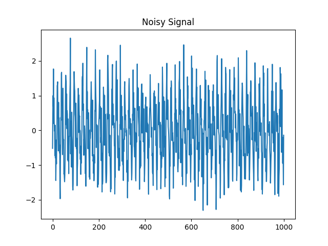
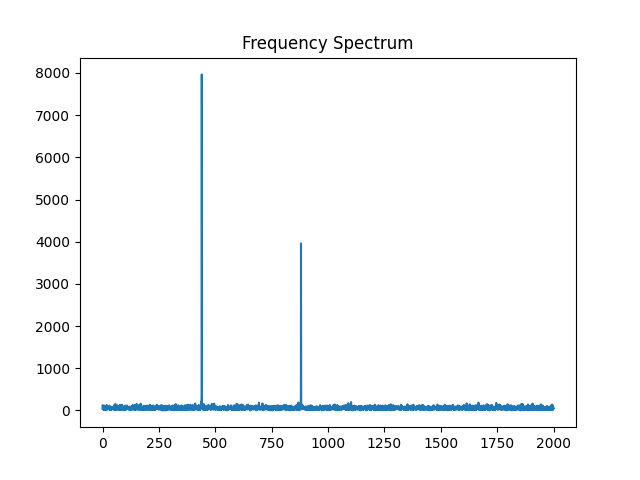
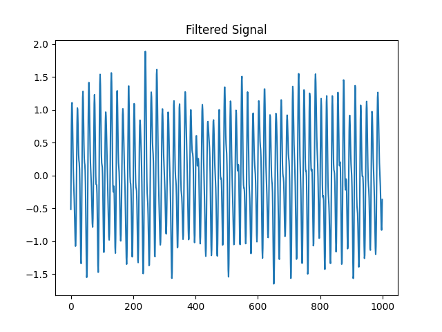

# 🎧 Audio Signal Recovery using DSP

##  Problem Statement

An audio signal was distorted with noise and interference. The objective was to recover the original signal using digital signal processing techniques.

---

##  Methodo

1. Loaded the noisy audio signal
2. Converted signal into frequency domain using FFT
3. Analyzed spectrum to identify noise components
4. Designed Butterworth Low Pass Filter
5. Applied filter to remove high-frequency noise
6. Reconstructed clean signal using inverse transform

---

##  Results

###  Noisy Signal (Time Domain Representation)

###  Frequency Spectrum

###  Filtered Signal

---

##  Output Audio

* Noisy audio → `noisy_audio.wav`
* Clean audio → `clean_audio.wav`

---

##  Observations

* Noise was concentrated in high-frequency region
* Filtering successfully reduced noise
* Slight smoothing observed after filtering
* FFT analysis revealed that noise was concentrated in higher frequency bands, which guided the choice of filter cutoff frequency.

---

##  Conclusion

This experiment demonstrates how transforming signals into the frequency domain allows efficient noise removal and recovery of useful information.

---

##  Additional Insight

Multiple cutoff frequencies were tested experimentally to achieve the best balance between noise reduction and signal clarity.
